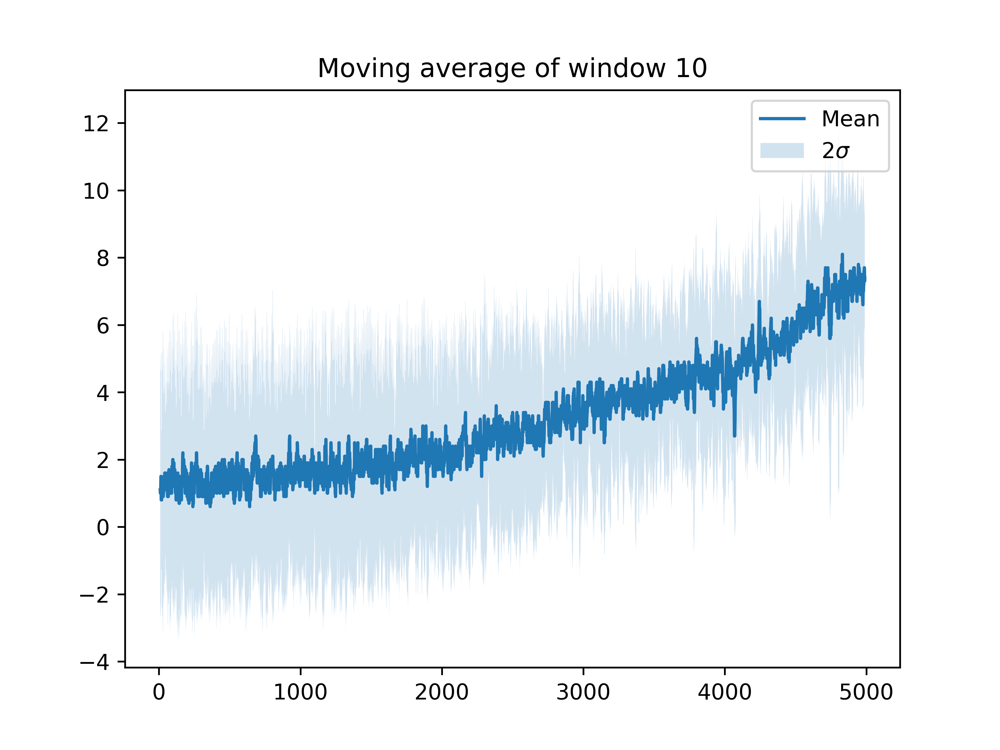

# Rainbow 2
## Dependencies

All dependencies (except obviously for JDK 1.8) can be installed with

```shell script
git checkout rainbow2 # This is to ensure that the environment is always the same
pip install -r requirements.txt
``` 

## Results

The new Rainbow agent seems very promising: it is able to destroy ~10 wood blocks in about 100 steps, but still it's far from perfect. After about 100 steps the agent usually gets stuck (look [here](https://uni-bielefeld.sciebo.de/s/9BIuiA39mkW38Tm) for an example) in a state where all action have the same advantage and it's unable to decide what to do. This is probably due to short training episodes (64 steps) and a maybe too strong reliance on Curriculum Learning (more about this will be discussed later).

 

The above is the moving average of training episode reward. All episodes had a length of 64 steps. That plot is the moving average of window 10 of the total reward per episode. This means that the value in the plot for episode `x` is the average of the total rewards obtained in episodes in the range `[x - 4, x + 5]`, which implies that the agent after 5000 * 64 steps of training, obtains ~6 blocks in 1 episode (64 steps).

## Training

The agent has been trained in a single forest for 5000 episodes of 64 steps each, with 15% of the episodes being curriculum learning episodes. On TechFak's `january` machine from the [compute](https://techfak.net/compute) cluster (with a mean load of ~37) it took about a week. 

To reproduce the training process the following commands can be executed:

```shell script
git checkout rainbow2 # This is to ensure that the environment is always the same
python train_rainbow.py -e 5000 -s 64 -c 15 --seed 420 --validate
```

A directory will be created in your `$HOME` to hold results and logs. The training process can be monitored through

```shell script
tail -f $HOME/your-rainbow-dir/logs/train.log | grep "rainbow-train"
```
 
### Parameters

- Input structure: `64x64x6`. These are two RGB images concatenated in a single array.
- Epsilon function: Linear decay.

#### Configuration

The configuration used is stored at `models/rainbow/rainbow_2/config.json`:

```json
{
  "RAINBOW_HISTORY": 2,
  "GAMMA": 0.93,
  "START_EPSILON": 0.99,
  "FINAL_EPSILON": 0.0,
  "ALWAYS_KEYS": [
    "forward"
  ],
  "REVERSE_KEYS": [],
  "EXCLUDE_KEYS": [
    "back",
    "left",
    "right",
    "sneak",
    "sprint"
  ],
  "FRAME_SKIP": 12,
  "EXCLUDE_NOOP": true,
  "MAX_CAMERA_RANGE": 1.875,
  "ACTION_SPACE": [
    "FWD_JUMP",
    "ATT",
    "LEFT",
    "RIGHT"
  ]
}
```

### Curriculum training

In this context we define a curriculum episodes as an episode where the agent is forced to follow a good trajectory between states to try and show it where does the reward come from.

A couple of good action sequences can be found in the `action-sequences/` directory and can be visualized with:

```shell script
python rainbow_action_sequence.py -s 64 --conf model/rainbow/rainbow_2/config.json --actions action-sequences/420_4_64.txt
```

This helps the agent to understand more easily what yields reward but for the action sequence to work at all we need to be training in the same forest which leads to overfitting. You can verify this by watching the first 6 blocks destroyed by the agent in any testing episodes with a seed of `420`.

To prevent this it could be useful to:

1. Use different "good" action sequences. This could show the agent a lot of different short action sequences that it could take a long time to figure out on its own (i.e. notice that the agent never turns itself backward, it has a tendency of going straight and aiming for the closest tree; by using a curriculum episode showing that there could be high reward states also behind itself, we could teach the agent to not get stuck in bad places).
2. Reduce the frequency of curriculum episodes the more the training progresses. Similarly to how epsilon is decreased linearly the more the training process progresses, we could decrease the frequency of curriculum episodes. 

## Testing the agent

To run the trained agent in a random environment you can run the following command:

```shell script
git checkout rainbow2
python test_rainbow.py -l model/rainbow/rainbow_2
```

### Keyboard agent

With this script you can play in the environment as if you were the agent by running this command:

```shell script
python minerl_keyboard.py
```

The actions keymaps are the following:

```
1 -> Jump and go forward
2 -> Attack
3 -> Left
4 -> Right
```